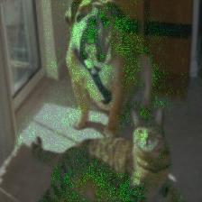
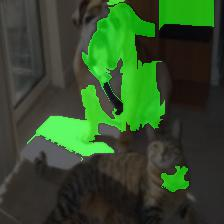

中文 | [**ENGLISH**](./README.md)


# InterpretDL: 基于『飞桨』的模型可解释性算法库

InterpretDL(全称*interpretations of deep learning models*), 是基于[飞桨](https://github.com/PaddlePaddle/Paddle) 的模型可解释性算法库，其中集成了许多可解释性算法，包括LIME, Grad-CAM, Integrated Gradients等等，还添加和更新许多SOTA算法和最新的可解释性算法。

*InterpretDL持续更新中，欢迎所有贡献。*

# 为什么选择InterpretDL

随着深度学习模型的越发复杂，人们很难去理解其内部的工作原理。“黑盒”的可解释性正成为许多优秀研究者的焦点。InterpretDL不仅支持经典的可解释性算法，也对最新的可解释性算法持续更新。

通过这些非常有效的可解释性方法，人们可以更好知道模型为什么好，为什么不好，进而可以针对性提高模型性能。

对于正在开发新可解释性算法的研究者而言，利用InterpretDL和已有算法比较也非常方便。

# :fire: :fire: :fire: News :fire: :fire: :fire:

- (2021/10/20) 新增 Transition Attention Maps (TAM) explanation method for PaddlePaddle [Vision Transformers](https://github.com/PaddlePaddle/PaddleClas/blob/release/2.3/ppcls/arch/backbone/model_zoo/vision_transformer.py). 一如往常，几行代码即可调用！ 详情查看 [tutorial notebook](https://github.com/PaddlePaddle/InterpretDL/blob/master/tutorials/ViT_explanations_tam.ipynb), 以及 [paper](https://openreview.net/forum?id=TT-cf6QSDaQ):

  * `TAM`: Tingyi Yuan, Xuhong Li, Haoyi Xiong, Hui Cao, Dejing Dou. Explaining Information Flow Inside Vision Transformers Using Markov Chain. In *Neurips 2021 XAI4Debugging Workshop*. 

```python
import paddle
import interpretdl as it

# load vit model and weights
# !wget -c https://paddle-imagenet-models-name.bj.bcebos.com/dygraph/ViT_base_patch16_224_pretrained.pdparams -P assets/
from assets.vision_transformer import ViT_base_patch16_224
paddle_model = ViT_base_patch16_224()
MODEL_PATH = 'assets/ViT_base_patch16_224_pretrained.pdparams'
paddle_model.set_dict(paddle.load(MODEL_PATH))

# Call the interpreter.
tam = it.TAMInterpreter(paddle_model, use_cuda=True)
img_path = 'samples/el1.png'
heatmap = tam.interpret(
        img_path,
        start_layer=4,
        label=None,  # elephant
        visual=True,
        save_path=None)
heatmap = tam.interpret(
        img_path,
        start_layer=4,
        label=340,  # zebra
        visual=True,
        save_path=None)
```
| image | elephant | zebra |
:-----------:|:-----------:|:-----------:
 |  | 


# Demo

可解释性算法对“黑盒”的预测做出了解释。

下表是使用一些可解释性算法对原始图片的可视化展示，告诉我们为什么模型做出了"bull_mastiff"的预测。

| Original Image | IntGrad ([demo](https://github.com/PaddlePaddle/InterpretDL/blob/master/tutorials/int_grad_tutorial_cv.ipynb)) | SG ([demo](https://github.com/PaddlePaddle/InterpretDL/blob/master/tutorials/smooth_grad_tutorial_cv.ipynb)) | LIME ([demo](https://github.com/PaddlePaddle/InterpretDL/blob/master/tutorials/lime_tutorial_cv.ipynb)) | Grad-CAM ([demo](https://github.com/PaddlePaddle/InterpretDL/blob/master/tutorials/grad_cam_tutorial_cv.ipynb)) |
:-----------:|:-----------:|:-----------:|:-----------:|:-----------:
||||

文本情感分类任务中模型给出积极或消极预测的原因也可以被可视化。 这里是[demo](https://github.com/PaddlePaddle/InterpretDL/blob/master/tutorials/ernie-2.0-en-sst-2-tutorials.ipynb). 对中文的样本数据也同样适用。 这里是[demo](https://github.com/PaddlePaddle/InterpretDL/blob/master/tutorials/ernie-1.0-zh-chnsenticorp-tutorials.ipynb).


# Contents

- [InterpretDL: Interpretation of Deep Learning Models based on PaddlePaddle](#interpretdl-interpretation-of-deep-learning-models-based-on-paddlepaddle)
- [Why InterpretDL](#why-interpretdl)
- [:fire: :fire: :fire: News :fire: :fire: :fire:](#fire-fire-fire-news-fire-fire-fire)
- [Demo](#demo)
- [Contents](#contents)
- [Installation](#installation)
  - [Pip installation](#pip-installation)
  - [Developer installation](#developer-installation)
- [Documentation](#documentation)
- [Usage Guideline](#usage-guideline)
- [Roadmap](#roadmap)
  - [Algorithms](#algorithms)
    - [Feature-level Interpretation Algorithms](#feature-level-interpretation-algorithms)
    - [Dataset-level Interpretation Algorithms](#dataset-level-interpretation-algorithms)
  - [Tutorials](#tutorials)
  - [References of Algorithms](#references-of-algorithms)
- [Copyright and License](#copyright-and-license)
- [Recent News](#recent-news)

# Installation

安装百度「飞桨」深度学习框架 [paddlepaddle](https://www.paddlepaddle.org.cn/install/quick), 建议选择CUDA支持版本。

## Pip installation

```bash
pip install interpretdl

# or with tsinghua mirror
pip install interpretdl -i https://pypi.tuna.tsinghua.edu.cn/simple
```

## Developer installation

```bash
git clone https://github.com/PaddlePaddle/InterpretDL.git
# ... fix bugs or add new features
cd InterpretDL && pip install -e .
# welcome to propose pull request and contribute
```

### Unit Tests

```
# run gradcam unit tests
python -m unittest -v tests.interpreter.test_gradcam
# run all unit tests
python -m unittest -v
```

# Documentation

在线链接: [interpretdl.readthedocs.io](https://interpretdl.readthedocs.io/en/latest/interpretdl.html).

或者下载到本地:

```bash
git clone https://github.com/PaddlePaddle/InterpretDL.git
cd docs
make html
open _build/html/index.html
```

# Usage Guideline

所有解释器都继承类 [`Interpreter`](https://github.com/PaddlePaddle/InterpretDL/blob/4f7444160981e99478c26e2a52f8e40bd06bf644/interpretdl/interpreter/abc_interpreter.py), 借助 `interpret(**kwargs)` 
以调用。
```python
# an example of SmoothGradient Interpreter.

import interpretdl as it
from paddle.vision.models import resnet50
paddle_model = resnet50(pretrained=True)
sg = it.SmoothGradInterpreter(paddle_model, use_cuda=True)
gradients = sg.interpret("test.jpg", visual=True, save_path=None)
```

使用细节在 [tutorials](https://github.com/PaddlePaddle/InterpretDL/tree/master/tutorials) 文件夹。

# Roadmap

我门希望构建一个强大的模型解释工具库。

## Algorithms

我们计划添加以下算法 (按解释对象分类):

### 特征层面的可解释性算法

* 以输入特征为解释对象
    - [x] SmoothGrad
    - [x] IntegratedGradients
    - [x] Occlusion
    - [x] GradientSHAP
    - [x] LIME
    - [x] GLIME (LIMEPrior)
    - [x] NormLIME/FastNormLIME
    - [x] LRP
    - [ ] More ...

* 以中间过程特征为解释对象
    - [x] CAM
    - [x] GradCAM
    - [x] ScoreCAM
    - [x] Rollout
    - [X] TAM
    - [ ] More ...

### 数据层面的可解释性算法
- [x] Forgetting Event
- [x] SGDNoise
- [x] TrainIng Data analYzer (TIDY)
- [ ] Influence Function
- [ ] More ...

## Tutorials

我们计划为每种可解释性算法提供至少一个例子，涵盖CV和NLP的应用。

现有的教程在 [tutorials](https://github.com/PaddlePaddle/InterpretDL/tree/master/tutorials) 文件夹。

# References of Algorithms

* `IntegratedGraients`: [Axiomatic Attribution for Deep Networks, Mukund Sundararajan et al. 2017](https://arxiv.org/abs/1703.01365)
* `GradCAM`: [Grad-CAM: Visual Explanations from Deep Networks via Gradient-based Localization, Ramprasaath R. Selvaraju et al. 2017](https://arxiv.org/abs/1610.02391.pdf)
* `SmoothGrad`: [SmoothGrad: removing noise by adding noise, Daniel Smilkov et al. 2017](https://arxiv.org/abs/1706.03825)
* `GradientShap`: [A Unified Approach to Interpreting Model Predictions, Scott M. Lundberg et al. 2017](http://papers.nips.cc/paper/7062-a-unified-approach-to-interpreting-model-predictions)
* `Occlusion`: [Visualizing and Understanding Convolutional Networks, Matthew D Zeiler and Rob Fergus 2013](https://arxiv.org/abs/1311.2901)
* `Lime`: ["Why Should I Trust You?": Explaining the Predictions of Any Classifier, Marco Tulio Ribeiro et al. 2016](https://arxiv.org/abs/1602.04938)
* `NormLime`: [NormLime: A New Feature Importance Metric for Explaining Deep Neural Networks, Isaac Ahern et al. 2019](https://arxiv.org/abs/1909.04200)
* `ScoreCAM`: [Score-CAM: Score-Weighted Visual Explanations for Convolutional Neural Networks, Haofan Wang et al. 2020](https://arxiv.org/abs/1910.01279)
* `ForgettingEvents`: [An Empirical Study of Example Forgetting during Deep Neural Network Learning, Mariya Toneva et al. 2019](http://arxiv.org/abs/1812.05159)
* `LRP`: [On Pixel-Wise Explanations for Non-Linear Classifier Decisions by Layer-Wise Relevance Propagation, Bach et al. 2015](https://journals.plos.org/plosone/article?id=10.1371/journal.pone.0130140)
* `Rollout`: [Quantifying Attention Flow in Transformers, Abnar et al. 2020](https://arxiv.org/abs/2005.00928)
* `TAM`: [Explaining Information Flow Inside Vision Transformers Using Markov Chain. Yuan et al. 2021](https://openreview.net/forum?id=TT-cf6QSDaQ)

# Copyright and License

InterpretDL 基于 [Apache-2.0 license](https://github.com/PaddlePaddle/InterpretDL/blob/master/LICENSE) 提供。

# Recent News

- (2021/07/22) 新增 Rollout Explanations for PaddlePaddle [Vision Transformers](https://github.com/PaddlePaddle/PaddleClas/blob/release/2.3/ppcls/arch/backbone/model_zoo/vision_transformer.py). 点击 [notebook](https://github.com/PaddlePaddle/InterpretDL/blob/master/tutorials/ViT_explanations_rollout.ipynb) 浏览可视化结果。

```python
import paddle
import interpretdl as it

# wget -c https://paddle-imagenet-models-name.bj.bcebos.com/dygraph/ViT_small_patch16_224_pretrained.pdparams -P assets/
from assets.vision_transformer import ViT_small_patch16_224
paddle_model = ViT_small_patch16_224()
MODEL_PATH = 'assets/ViT_small_patch16_224_pretrained.pdparams'
paddle_model.set_dict(paddle.load(MODEL_PATH))

img_path = 'assets/catdog.png'
rollout = it.RolloutInterpreter(paddle_model, use_cuda=True)
heatmap = rollout.interpret(img_path, start_layer=0, visual=True)
```
